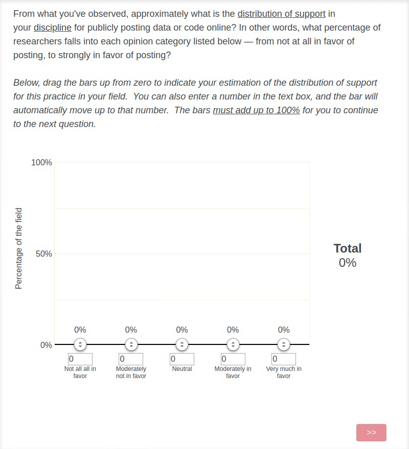

# Qualtrics Histogram Response Widget

This project adds a custom histogram response widget to selected question IDs
in your Qualtrics survey. Users can drag the bars up or down to indicate their
response or they may type in the values in the input fields. The total
percentage must be equal to 100% before the user may proceed to the next
question.



## Usage

### Overview

1. Create survey and questions that should be using the histogram widget. You
   can view prior surveys that use the histogram to see how the questions are
created. We've had success with both "Constant Sum" and "Slider" types.

2. Find the internal questions IDs for the questions that need the histogram
   widget. These internal question IDs **are not** identical to the IDs seen in
the survey builder.

3. Update "Look & Feel" of survey to include the list of internal question IDs
   and the script tag for the histogram widget.

### Finding internal question IDs

For each question that needs the histogram widget, you’ll need to do the
following in the Chrome browser:

1. Click on the question in survey builder.
2. Click "Preview Question" in right sidebar.
3. Open "Console" panel in Google DevTools. (On Mac: `Command+Option+J`; on
   Windows and Linux `Control+Shift+J`).
4. Click dropdown labeled "top" in the upper left area of the Console. Select
   the option that starts with "preview-view".
5. Copy and paste `Qualtrics.SurveyEngine.QuestionInfo` into the console and
   press enter. The result should be the internal question ID of that question.
It starts with "QID" followed by a number.
6. Make a note of the question ID.

Sample demo of completing the steps in Chrome: 

### Adding widget to the survey

This final step requires the list of internal question IDs that were determined
in the previous step. We’ll first need to create some JavaScript that we can
copy and paste later. For example, let’s say you found you needed to add the
histogram to QID1 and QID2 in the previous step. The JavaScript that you’d want
will look like this:

```js
<script>window.hquestions = "QID1,QID2";</script>
<script src="https://agathongroup.github.io/qualtrics-histogram/d/b-77ebb1bdecb9296ca8de.js"></script>
```

You can see where QID1 and QID2 are placed in the comma separated list above.
This is where you’d put the list of internal question IDs that were discovered
in the previous step. The other parts of the code above should be identical and
not changed.

1. Click "Look & Feel".
2. Click the "Advanced" tab.
3. Click "edit" underneath "Header".
4. Click the "Source" button.
5. Paste JavaScript code that was created above into the field and click
   "Save".
6. Click "Save" again on "Look & Feel" dialog.

If you already had some survey questions setup and added some more, you could
replace the old JavaScript code with the new JavaScript code or simply update
the comma separate list of internal question IDs to reflect your new list that
need the histogram widget.

You may need to wait a few minutes before the newly added questions are being
shown with the histogram in the preview.
